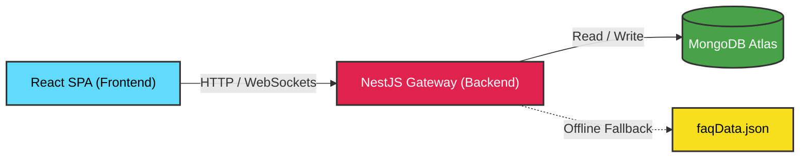

# AskSam — Samagama Collaborative FAQ Platform

<div align="center">


> **AskSam is a lightweight, crowdsourced FAQ and Q&A portal for Samagama students** — built at the Vicharanashala Lab for Education Design, IIT Ropar.
>
> Students search once. If an answer doesn't exist, they post it to a peer-review queue. Verified peers resolve it, categorize it under structural tracks like ViBe (Vikram Betal), and promote the definitive response straight into the permanent knowledge treasury.

</div>

---

## 📋 Table of Contents

- [🌟 Standout Innovations](#-standout-innovations)
- [🎯 Comprehensive Feature List](#-comprehensive-feature-list)
- [📱 Interactive Project Walkthrough \& Demo](#-interactive-project-walkthrough--demo)
- [🔔 Real-Time Notifications](#-real-time-notifications)
- [🎨 UI \& Design System](#-ui--design-system)
- [System Architecture \& Workflow](#-system-architecture--workflow)
- [Tech Stack](#-tech-stack)
- [Project Structure](#-project-structure)
- [Database Schemas](#-database-schemas)
- [API Endpoints](#-api-endpoints)
- [Getting Started](#-getting-started)
- [FAQ](#-faq)
- [Contributors](#-contributors)

---
## Demo Video
https://drive.google.com/file/d/1mr4TfA0GNu_sOrY3HePQdcapf6Emra83/view?usp=drive_link

## 🌟 Standout Innovations (Why AskSam Stands Out)

When building AskSam, we focused heavily on enterprise-grade reliability and frictionless User Experience (UX):

1. **High-Availability Offline Fallback**: We engineered the NestJS backend to be fault-tolerant. If the primary MongoDB cluster ever goes down, the system gracefully falls back to a read-only `faqData.json` file. The app survives database connection crashes that would normally take down standard student projects.
2. **Predictive Search & Duplicate Check**: The platform uses client-side fuzzy search (Fuse.js) for predictive search and queries the backend for similar questions while composing new questions to proactively suggest matches before submission.
3. **Admin Moderation & Promotion Workflows**: A clean, structured lifecycle where peer answers can be verified and elevated by administrators to canonical FAQs.
4. **Performance-First Animations**: We achieved beautiful, fluid UI micro-animations (fade-ins, slide-ups, pulse-glows) natively using CSS keyframes in Tailwind v4, entirely avoiding heavy JavaScript animation libraries that bloat the client bundle.

---

## 🎯 Comprehensive Feature List

AskSam was designed with a massive suite of features tailored for a perfect academic Q&A experience. Here is an exhaustive list of every feature currently running in the platform:

### 🔐 Authentication & Security
* **JWT-Based Authentication:** Secure, token-based login sessions utilizing JWT tokens stored in localStorage.
* **Role-Based Access Control (RBAC):** Strict NestJS Guards differentiating privileges between standard `students` and `admins`.
* **API Rate Limiting:** Built-in NestJS throttler protecting authentication and credentials recovery from spam.
* **Bcrypt Password Encryption:** Hashing all user credentials before database storage.

### 🔍 Search & Discovery
* **Predictive Smart Search:** Real-time dropdown search suggestions client-side (Fuse.js) that query cached FAQs as the user types.
* **Dynamic Category Tracks:** Pre-defined, admin-approved content tracks (e.g., *ViBe*, *NOC*, *Internships*) that users can click to filter the knowledge base immediately.
* **Visual Tagging System:** Colored badge tags identifying the context of every FAQ for rapid skimming.

### 📝 Question & Answer Mechanics
* **Standard Text Inputs:** Standard textarea and title fields for writing question details and answers cleanly.
* **Community Voting System:** Upvote and downvote mechanics to vote on peer answers.
* **Real-time Similarity Checks:** Checks for similar FAQs via the backend while composing a question to prevent duplicates.

### ⚖️ Moderation & Workflow (The Data Lifecycle)
* **Custom Queue Sorting:** Sort open questions chronologically (newest or oldest) in the moderation queue.
* **Verification Promotion:** A one-click admin action (`Verify & Convert to FAQ`) that elevates verified answers to the canonical library.
* **Administrative Category Controls:** Admin tools to create new categories, rename existing categories, and confirm pending category suggestions.

### ⚡ Real-Time & Reliability
* **WebSocket State Propagation:** Socket.IO integration powering instant update signals and notifications across connected clients when questions or answers are modified.
* **High-Availability Offline Mode:** The NestJS API gracefully falls back to a read-only `faqData.json` file if the primary MongoDB cluster is offline.

### 👤 User Engagement & Profiles
* **Profile Activity Tracking:** Counters tracking questions asked, answers given, verified answers, and bookmarked FAQs.
* **Personal Bookmarking:** A centralized tab for users to save and quickly reference important FAQs and questions.
* **My Questions Dashboard:** A dedicated space tracking the live status (`open`, `answered`, `reopened`) of every query a student has submitted.

---

## 📱 Interactive Project Walkthrough & Demo

*Click the dropdowns below to take a virtual tour of the platform and understand exactly what every page and button does!*

<details>
<summary><b>🏠 1. Home Page & Search Experience</b></summary>
<br/>
<b>The Goal:</b> To help students find answers instantly without cluttering the database with duplicate questions.

* **"Search FAQs" Bar**: A predictive, fuzzy dropdown search. As the user types, it dynamically searches the cached FAQs client-side (via Fuse.js) and displays matching questions.
* **"Browse Tracks" Buttons**: Quick-filter buttons (e.g., NOC, Offer Letter, ViBe) that instantly load verified FAQs belonging to that specific category.
* **"Ask a Question" Button**: Transitions the user to the Ask Page where they can submit new queries if their answer was not found.
</details>

<details>
<summary><b>📝 2. The Ask Page (Question Submission)</b></summary>
<br/>
<b>The Goal:</b> To capture detailed questions while suggesting existing answers.

* **Title & Description Inputs**: Standard text fields for entering the question title, detailed context description, category selection, and tags.
* **Inline Similarity Checker**: As the user types their title, the page queries the backend `/api/faqs/similar` endpoint to display similar FAQs and prevent duplicate submissions.
* **"Submit" Button**: Posts the question to MongoDB with an `open` status. Access is protected to authenticated students.
</details>

<details>
<summary><b>📥 3. The Moderation Queue</b></summary>
<br/>
<b>The Goal:</b> A dedicated workspace for community peers to find and answer open questions.

* **Flexible Sorting**: The queue list allows sorting open/reopened questions by newest or oldest.
* **"Answer this Question" Button**: Clicking a card opens the Question Thread so a peer can write a response.
* **Live Socket Updates**: Updates the queue dynamically across connected clients when questions are answered.
</details>

<details>
<summary><b>💬 4. Question Thread & Community Answers</b></summary>
<br/>
<b>The Goal:</b> Where the actual collaboration happens.

* **Standard Textarea Editor**: Textarea reply box where peers type their answers.
* **"Submit Answer" Button**: Posts the answer to the thread and triggers a real-time notification to the student who asked it.
* **Upvote / Downvote Buttons**: The community can vote on which answer is the most accurate.
</details>

<details>
<summary><b>👑 5. Admin Dashboard & Verification</b></summary>
<br/>
<b>The Goal:</b> Reviewing questions and verifying correct information.

* **"Verify" & "Convert to FAQ" Buttons**: Allows admins to verify individual answers. Admins can also promote the verified answer into a permanent entry in the canonical FAQ database.
* **Category Manager Tab**: Allows admins to create new categories, rename existing ones, and approve pending category suggestions from students.
</details>

<details>
<summary><b>👤 6. User Profile & Bookmarks</b></summary>
<br/>
<b>The Goal:</b> Keeping users engaged and allowing them to track their progress.

* **Activity Metrics**: Performance stats counting questions asked, answers given, verified answers, and bookmarked FAQs.
* **"My Bookmarks" Tab**: A list of FAQs the user has bookmarked for quick reference.
* **"My Questions" Tab**: A dashboard showing the status (`open`, `answered`, `reopened`) of all the questions the user has asked.
</details>

<details>
<summary><b>📚 7. Browse FAQs (`/faqs`)</b></summary>
<br/>
<b>The Goal:</b> A dedicated hub to explore the entire permanent knowledge base.

* **Category Filters**: Users can dynamically filter the entire library by specific tracks (e.g., Offers, ViBe).
* **Tag System**: FAQs display visual tags indicating their context, making it easy to skim large amounts of information.
</details>

<details>
<summary><b>🔔 8. Notification Center (`/notifications`)</b></summary>
<br/>
<b>The Goal:</b> A centralized history of all platform alerts.

* **Activity Log**: Provides a permanent ledger of all interactions (answers, verifications, upvotes) related to the user.
* **Mark as Read**: Users can clear their notification badges by clicking to acknowledge they've seen the updates.
</details>

<details>
<summary><b>🔐 9. Authentication & Login Hub (`/login`)</b></summary>
<br/>
<b>The Goal:</b> A highly polished, secure, and intuitive gateway for both students and administrators.

* **Dual-Tab Interface**: Instantly toggle between "Student" login (username-based) and "Admin" login (email-based) without loading a new page.
* **Client-Side Validation**: Real-time regex validation ensures usernames contain valid characters and passwords meet length requirements.
* **Password Recovery Flow**: A built-in "Forgot Password" state that allows users to reset their credentials securely directly within the UI.
</details>

---

## 🔔 Real-Time Notifications

To ensure the community feels alive and responsive, AskSam utilizes a **WebSocket Architecture** via `Socket.IO`.
* **Instant Delivery**: Users receive live toast notifications the exact moment someone answers their question, upvotes their response, or an admin verifies their answer.
* **State Propagation**: The Moderation Queue updates in real-time. If a question is answered by one user, the status updates dynamically for other users viewing the queue.

---

## 🎨 UI & Design System

* 🌿 **Sage Academic Palette**: A clean, scholarly layout built on Tailwind CSS v4 featuring deep sage greens (`#5E7A5A`), crisp whites (`#FFFFFF`), and warm sand/cream accent tones.

---

## 🏗️ System Architecture & Workflow

### Technical Topology



### Platform Life-Cycle

```text
  ┌──────────┐     ┌────────────┐     ┌─────────┐     ┌──────────────┐
  │  Login / │ ──▶ │  Search    │ ──▶ │  Ask    │ ──▶ │    Queue     │
  │  Signup  │     │  Existing  │     │  New Q  │     │  (Open / Reopen)
  └──────────┘     └────────────┘     └─────────┘     └──────┬───────┘
                                                             │
                            ┌────────────────────────────────┘
                            ▼
                     ┌──────────────┐     ┌─────────────────────┐
                     │  Community   │ ──▶ │  Best Answer        │
                     │  Answers     │     │  Marked & Verified  │
                     └──────────────┘     └──────────┬──────────┘
                                                     │
                              ┌──────────────────────┴──────────────┐
                              ▼                                     ▼
                       ┌─────────────┐                      ┌──────────────┐
                       │  Promoted   │                      │  Reopened    │
                       │  to FAQ     │                      │  by Admin    │
                       │  ✅ FAQ     │                      │  🔄 Reopen   │
                       └─────────────┘                      └──────┬───────┘
                                                                   │
                                                              ┌────▼────┐
                                                              │ Back to │
                                                              │  Queue  │
                                                              └─────────┘
```

---

## 🛠️ Tech Stack

### Frontend
* **React 18** - UI components utilizing state hooks and concurrent rendering features.
* **Vite 5** - Lightning-fast frontend build tool and hot-module replacement dev server.
* **Tailwind CSS v4** - Utility-first styling with `@theme` CSS variables and custom animations.
* **TanStack Query v5** - Server-state manager, handling caching, background refetching, and mutations.
* **React Router v6** - Client-side SPA routing with lazy-loaded page routes.
* **Socket.IO Client** - Real-time WebSocket event handling for notifications and live updates.
* **Axios** - Promise-based HTTP client with request/response interceptors.

### Backend
* **NestJS 10** - Progressive Node.js backend framework providing reliable, structured architecture.
* **TypeScript** - Strict type-safe programming across schemas, controllers, and services.
* **Mongoose 8** - MongoDB object modeling schema library.
* **MongoDB** - Primary document database (local instance or Atlas connection cluster).
* **JWT & Guards** - Stateless token-based cookie authentication and role-based access control (RBAC).
* **Socket.IO** - WebSocket gateway for live notifications and queue state propagation.
* **Rate Limiting** - API rate limiting via `@nestjs/throttler` (e.g. 10 req/min on auth endpoints).
* **Bcrypt** - Password hashing and secure encryption.

---

## 📁 Project Structure

```text
AskSam/
├── backend/
│   ├── src/
│   │   ├── common/           # Shared guards, decorators, and interceptors
│   │   ├── modules/          # Core NestJS modules (auth, faq, notification)
│   │   ├── schemas/          # Mongoose database schemas (user, question, faq, etc.)
│   │   ├── app.module.ts     # Root application module
│   │   └── main.ts           # NestJS entry point
│   ├── scripts/              # Migration and seeding utilities
│   ├── nest-cli.json         # NestJS CLI configuration
│   ├── tsconfig.json         # TypeScript configuration
│   └── package.json          # Backend dependencies
│
├── frontend/
│   ├── public/               # Static assets
│   ├── src/
│   │   ├── components/       # Reusable UI building blocks (FloatingBubbles, Footer, etc.)
│   │   ├── context/          # Global React state contexts (Theme, User)
│   │   ├── hooks/            # Custom React hooks
│   │   ├── layouts/          # Core structural page layouts
│   │   ├── pages/            # View pages (HomePage, LoginPage, AdminPage, QueuePage, etc.)
│   │   ├── services/         # Axios client setup and API module wrappers
│   │   ├── utils/            # Shared helper functions
│   │   ├── App.jsx           # Main router and lazy routes setup
│   │   └── index.css         # Styling, keyframe animations, & Tailwind v4 theme variables
│   ├── tailwind.config.js    # Tailwind configurations
│   ├── vite.config.js        # Vite compilation configuration
│   └── package.json          # Frontend dependencies
│
└── README.md
```

---

## 🗃️ Database Schemas

The core data structures powering AskSam in MongoDB:

| Schema Name | File Location | Purpose & Key Fields |
|:---|:---|:---|
| **Question** | `question.schema.ts` | Tracks student submissions. Statuses: `open`, `answered`, `reopened`. Stores contributorName, contributorId, category, tags, and views. |
| **Answer** | `answer.schema.ts` | Stores peer answers for student questions. Contains questionId reference, content text, contributorName, contributorId, isVerified flag, isAccepted flag, upvotes/downvotes, and voters array for vote tracking. |
| **FAQ** | `faq.schema.ts` | The canonical library. Stores verified questions, confirmed answers, category string, originalQuestionId, isPinned flag, and an array of unhelpfulFeedbacks (reason, userLabel). |
| **User** | `user.schema.ts` | Handles authentication. Stores username, email, password, role (`student` or `admin`), following/followers arrays, and notificationPreferences. |
| **Category** | `category.schema.ts` | The structural tracks (e.g., ViBe). Stores category name, icon, and isActive (approved status). |
| **Notification** | `notification.schema.ts` | Stores live event triggers for Socket.IO. Tracks senderName and isRead status. |
| **SearchAnalytics** | `search-analytics.schema.ts` | Logs search queries and flags if they failed to return results. |

---

## 📚 API Endpoints

All API endpoints are prefixed with `/api`. Protected routes utilize NestJS JWT Guards (`Authorization: Bearer <token>`).

### Auth & User (`/api/auth`, `/api/users`)
* `POST /api/auth/signup` - Create a new student account
* `POST /api/auth/login` - Authenticate and receive a JWT
* `GET /api/auth/me` - Get current session profile
* `POST /api/auth/forgot-password` - Reset student credentials directly
* `GET /api/users` - Fetch a list of all users
* `PATCH /api/users/:id` - Update user settings (e.g. notification preferences)
* `GET /api/users/:userId/stats` - Fetch contribution metrics for a user profile
* `GET /api/users/:userId/activity` - Fetch user activity heatmap/contribution history

### Questions & Queue (`/api/questions`)
* `POST /api/questions` - Submit a new question
* `GET /api/questions` - Fetch all questions (supports status, category, and search filters)
* `GET /api/questions/open` - Fetch open/reopened questions
* `GET /api/questions/:id` - Fetch single question detail
* `PATCH /api/questions/:id/answer` - Submit a peer answer to a question
* `PATCH /api/questions/:questionId/vote` - Upvote/downvote a question or answer
* `PATCH /api/questions/:id/reopen` - Reopen an answered/closed question
* `PATCH /api/questions/:id/close` - Close a question
* `POST /api/questions/:id/convert-to-faq` - Promote a verified answer to a canonical FAQ

### FAQs (`/api/faqs`)
* `GET /api/faqs` - Search and filter verified FAQ library
* `GET /api/faqs/:id` - Fetch single FAQ detail
* `POST /api/faqs` - Create a new FAQ directly
* `PATCH /api/faqs/:id` - Update an FAQ
* `DELETE /api/faqs/:id` - Delete an FAQ
* `POST /api/faqs/:id/upvote` - Upvote a canonical FAQ
* `PATCH /api/faqs/:id/view` - Increment FAQ view count
* `PATCH /api/faqs/:id/feedback` - Log helpful/unhelpful feedback with reasons

### Categories (`/api/categories`)
* `GET /api/categories` - List approved categories
* `GET /api/categories/stats` - Fetch category stats
* `POST /api/categories` - Suggest or create a new category
* `PATCH /api/categories/confirm` - Approve/confirm suggested categories
* `PATCH /api/categories/rename` - Rename a category

### Bookmarks & Follows (`/api/users/:userId/...`)
* `PATCH /api/users/:userId/bookmark/:questionId` - Toggle bookmark status for a question or FAQ
* `GET /api/users/:userId/bookmarks` - Fetch bookmarked items for a user
* `PATCH /api/users/:followerId/follow/:followingId` - Follow or unfollow a user
* `GET /api/users/:userId/following` - Fetch list of followed users

### Platform Management (`/api/admin`, `/api/notifications`)
* `GET /api/admin/stats` - Fetch system-wide admin dashboard statistics
* `GET /api/admin/search/failed` - Fetch failed search analytics logs
* `GET /api/admin/feedback/unhelpful` - Fetch unhelpful feedback details
* `GET /api/notifications/:userId` - Fetch notification history for a user
* `PATCH /api/notifications/:id/read` - Mark a notification as read
* `GET /api/search/trending` - Fetch trending search queries
* `GET /api/search/full` - Perform full-text search on FAQs
* `GET /api/faqs/similar` - Find similar FAQs (to check duplicates)

---

## ⚙️ Environment Setup

To ensure security, environment variables are not committed to this repository. You must manually create these configuration files before starting the servers.

### 1. Backend Configuration (`backend/.env`)
Navigate to the `backend/` directory and create a new file exactly named `.env`. Paste the following configuration:
```env
# The port the NestJS API will run on
PORT=3000

# The connection string for your MongoDB database.
MONGODB_URI=mongodb://localhost:27017/samagama

# The cryptographic key used to sign JSON Web Tokens for authentication.
JWT_SECRET=samagama_development_secret_key_123!
```

### 2. Frontend Configuration (`frontend/.env`)
Navigate to the `frontend/` directory and create a new file exactly named `.env`. Paste the following configuration:
```env
# The base URL where the Vite frontend will send API requests.
VITE_API_URL=http://localhost:3000/api
```

---

## 🚀 Getting Started (Step-by-Step Guide)

We have designed AskSam to be extremely easy to spin up in a local development environment. Follow this guide to get the platform running.

### Prerequisites Check
Before you begin, verify that your machine has the following installed:
* **Node.js** (v18.x or higher) — *Verify by running `node -v` in your terminal.*
* **npm** (v9.x or higher) — *Verify by running `npm -v` in your terminal.*
* **MongoDB** (v6.x or higher) — *Must be actively running on your machine (default port 27017), or you must have a cloud Atlas URI.*

### Step 1: Clone the Repository
```bash
git clone https://github.com/vicharanashala/cs35.git
cd cs35
```
*(Make sure you have completed the **Environment Setup** section above before proceeding to Step 2).*

### Step 2: Initialize the Backend (NestJS API)
The backend acts as the brain of AskSam, handling database reads, writes, and WebSocket broadcasts.
```bash
# 1. Enter the backend directory
cd backend

# 2. Install all strict TypeScript and NestJS dependencies
npm install

# 3. Start the NestJS development server in watch mode
npm run start:dev
```
*Wait until you see the message `[NestApplication] Nest application successfully started` in your terminal.*

### Step 3: Initialize the Frontend (React SPA)
Open a **new, completely separate terminal window** (do not close the backend terminal).
```bash
# 1. Enter the frontend directory
cd frontend

# 2. Install all React, Vite, and Tailwind dependencies
npm install

# 3. Start the Vite dev server
npm run dev
```
*The terminal will display a local URL. Open your browser and navigate to `http://localhost:5173` to interact with AskSam!*

---

### Step 4: Seeding Mock Data (Recommended for Evaluators)
If you want to instantly see what a populated knowledge base looks like without typing it all manually, we have included a seeding script.

Open a third terminal window:
```bash
cd backend/scripts

# Run the Node.js module to inject structured FAQ documents into MongoDB
node seed_faqs.mjs
```
*You will see a success message indicating how many records were inserted. Refresh your browser at `http://localhost:5173` and you will immediately see populated categories and FAQs.*

Other available backend scripts:
* `node clear_db.mjs` - Clears all Mongoose collections (⚠️ Destructive)
* `node echo_env.mjs` - Validates and prints active environment variables
* `node recreate_email_index.mjs` - Drops and rebuilds MongoDB indices on email fields

### Production Build
```bash
# Backend compilation
cd backend && npm run build && npm run start:prod

# Frontend static asset build
cd frontend && npm run build
```

---

## 📊 Build & Test Status

| Scope | Command / Suite | Status |
|---|---|---|
| Frontend build | `npm run build` | ✅ Passing |
| Backend build | `npm run build` | ✅ Passing |

---

## 💬 FAQ

**Q: Does the application work if MongoDB is offline?**
> Yes, the backend includes an automated fallback mechanism that serves static FAQ content in read-only mode from `faqData.json` when the database cannot be reached.

**Q: How does the reopen flow work?**
> The backend API supports a reopen endpoint (`PATCH /api/questions/:id/reopen`) that reverts answered or closed questions back to `reopened` status, returning them to the moderation queue.

**Q: How does a peer-reviewed answer elevate to a canonical FAQ?**
> An administrator verifies the student-submitted answer and hits "Convert to FAQ". This prompts the NestJS API to push the question and verified answer directly into the permanent FAQ feed.

---

## 👥 Contributors

This platform was developed with ❤️ by the Vicharanashala internship program students at IIT Ropar:

| Contributor | Focus Area | Profile |
|:---|:---|:---|
| **Mano Shruthi S** | Team Lead & Project Developer | [@manoshruthis](https://github.com/manoshruthis) |
| **Dishi Gupta** | Database Architecture | [@dishigpt](https://github.com/dishigpt) |
| **Pavan Kumar M** | Documentation & Prototype | [@pavankumarmadamanchi72-ui](https://github.com/pavankumarmadamanchi72-ui) |
| **Dusi Keerthi Prasanna** | Documentation | [@dusikeerthiprasanna](https://github.com/dusikeerthiprasanna) |
| **Putta Sri Tejaswi** | Documentation | [@sritejaswi30-rgb](https://github.com/sritejaswi30-rgb) |
| **Rashmi Risha J** | Documentation | [@rashmirisha](https://github.com/rashmirisha) |
| **Thivesha M. S** | Documentation | [@thivesha](https://github.com/thivesha) |
| **Ambati Vedanandana** | Documentation | [@ambativedanandana-byte](https://github.com/ambativedanandana-byte) |
| **Divyadharshini S** | Documentation | [@dd28703](https://github.com/dd28703) |
| **Akshaya Boggarapu** | Documentation | [@akshayaboggarapu](https://github.com/akshayaboggarapu) |

> Special acknowledgment to **MiniMax - 2.7** for assisting with code formatting, reviews, and documentation.

---

## 📝 License

Distributed under the **MIT License**. Feel free to use, modify, and distribute this repository with attribution.

[](https://vicharanashala.ai)

---

<div align="center">

**If this project helped you, consider giving it a ⭐ — it means a lot to the team!**

</div>
